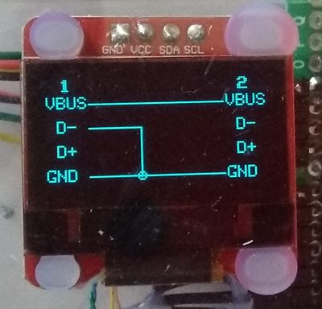

# USB cable tester V2

## What it is
It is an evolution of my [USB cable tester](https://github.com/fdufnews/USB_cable_tester)  
The first version required a connection to a terminal in order to display the status of the USB cable. This new one has a Graphical Interface using a small 128x64 pixels 0.96" OLED display. Using this OLED display and an Arduino Nano clone help keeping the price of the tester low.  
It also uses 2 USB multi-adapters so that any cable can be tested.  

| Item | Price | Qty | Total |
| :---: | :---: | :---: | :---: |
| Arduino Nano clone | 3€ | 1 | 3€ |
| 0.96" OLED display | 6€ | 1 | 6€ |
| USB multi adapter | 2€ | 2 | 4€ |
| Grand total | | | 13€ |

Price includes VAT  

The tester can be powered either by the USB port of the Nano or by a battery.   
My prototype is housed in an Hi8 video cassette case and as it is only used occasionally. I don't think it is necessary to add a battery in the box.  
The cable is continuously scanned to help identify cables with intermittent connection.  

## Hardware
The hardware directory contains a pdf with the schematic and a kicad 6.0 archive of the schematic.  
The USB multi adapters have only USB A (male/female), USB C, micro USB. As there are still development board that are using mini SB I have a lot of them in my drawers. So I have have added a mini USB on one of the adapter.Small AWG32 wires are solded on the mini USB and connected on the 4 holes located in the corner of the card. A layer of epoxy insulates the socket and hold it in place.  
![Picture of modified adapter](pictures/IMG_20220719_102000.jpg]
Everything can take place in an old Hi8 cassette box

## How it works
All the IOs on the 2 USB adapters are programmed as input.  
All 8 lines connected to a 4.7k Ohms resistor network  
 
 - All lines set as input
 - one line set as output
 - set output HIGH
 - pull the resistor network LOW
 - read lines and mark those that are HIGH by setting bit0 in a 4x4 array
 - set output LOW
 - pull the resistor network HIGH
 - read lines and mark those that are LOW by setting bit1 in the array
 - repeat for every line

The content of the array is then used to draw the connections on the display.

## Splash screen
The splashscreen is generated with the make_splash.py python script that is part of the Adafruit_SSD1306 library. It takes a picture as input and generates a .h file.  
I never managed to get a picture that does not contain unwanted dots. I had to correct the file by hand. I suppose this is a side effect of the encoding of the pictures even when set to high quality.  
|    |   |
| :---: | :---: |
|  | splashscreen |
|  | Full USB cable |
|  | Charge only USB cable |
|  | Defective USB cable |

